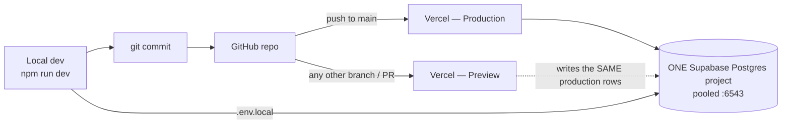
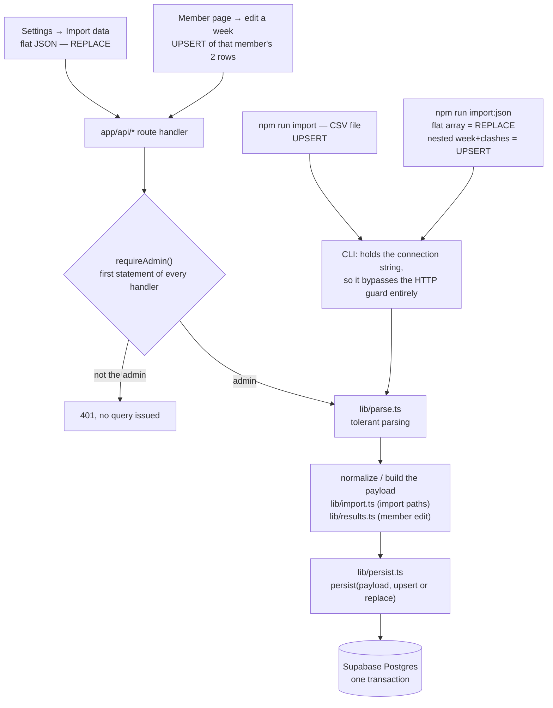

# Raid Clash Tracker

A web dashboard that tracks one RAID: Shadow Legends clan's weekly **Hydra Clash** and
**Chimera Clash** results — per-member keys used, damage dealt, averages, participation and
week-over-week trends. It is a Next.js App Router app over a **Supabase Postgres** database,
reached through a pooled (`:6543`) connection URI, with **Supabase Auth** used for sign-in
only. **Every page is readable by anyone; every write belongs to one admin account** — and
with no database configured at all it still runs, on a bundled demo dataset.

This file is the **hub**: what the pieces are, how they fit, and where the real
documentation lives. It deliberately does not teach setup or day-to-day use.

| If you want to | Read |
|---|---|
| **Use the app** — import a week, back up, restore, reset, what a metric actually means | [`docs/user-guide.md`](docs/user-guide.md) |
| **Work on the app** — clone → running → deployed, plus the 16 things that bite | [`docs/engineer-onboarding.md`](docs/engineer-onboarding.md) |
| Configure environments, or debug a deployment | [`docs/reference/deployment.md`](docs/reference/deployment.md) |
| Understand the ingest pipeline in engineering terms | [`docs/reference/data-pipeline.md`](docs/reference/data-pipeline.md) |
| Understand the admin-only rule | [`docs/reference/auth.md`](docs/reference/auth.md) |
| Style anything | [`docs/reference/design-system.md`](docs/reference/design-system.md) |
| Know the current architecture, or why a decision was made | [`docs/project-map.md`](docs/project-map.md) · [`docs/build-log.md`](docs/build-log.md) |

## Quick start

```bash
npm install
npm run dev                 # http://localhost:3000 — demo data, no configuration needed
cp .env.example .env.local  # then fill it in: .env.example is the setup document
npm run db:migrate          # apply supabase/migrations/*.sql in order; safe to re-run
npm run build               # the verify step — there is no test suite
```

Everything those five lines gloss over — the pooler-host trap, `prepare: false`, Node
versions, signing in — is in [`docs/engineer-onboarding.md`](docs/engineer-onboarding.md)
and [`.env.example`](.env.example). Note that `npm run lint` **exits 1 by design** (9 errors
+ 1 warning is the approved baseline).

## Which numbers you are looking at

Three honest states, and a broken database is not one of them:

| State | What renders |
|---|---|
| **Live** — connection string set, migrations applied, rows imported | your real clan numbers |
| **Connected but empty** — reachable and migrated, no rows yet (e.g. after a Reset) | a **genuinely empty** dashboard, not sample data |
| **No connection string, or tables not created yet** (`42P01`) | the bundled demo dataset, **Weeks 20–24** ([`lib/mock-data.ts:18-24`](lib/mock-data.ts)) |

Anything else — wrong password, wrong host, a paused Supabase project, no network —
renders the **error page**. The dashboard never quietly serves demo numbers as real.
Clan Settings names which state you are in; "the page loaded" is not evidence of anything.

## Pages

| Route | What it is |
|---|---|
| `/` | Overview: both clash cards, clan performance table, timeline strip, key-usage donut |
| `/hydra`, `/chimera` | One clash: card, weekly bar chart, sortable Player Breakdown |
| `/timeline` | Weekly Hydra vs Chimera totals across every tracked week |
| `/members` | Roster, active first then former, with lifetime totals |
| `/members/[memberId]` | One member: lifetime and per-clash cards, week-by-week history, avatar, per-week edit |
| `/settings` | Clan Settings: counters, data-source status, admin access, **Import data** tab, Data Management |
| `/import` | A **307 redirect to `/settings`** ([`app/import/page.tsx:5`](app/import/page.tsx)) — the import UI moved into the Settings tab |
| `/login` | Sign-in. **Deliberately absent from the sidebar**: one account, and a public dashboard should not advertise a login door |

Two labels mean **two different things depending on the page** — `Participation` (key usage
vs attendance) and `Trend` (damage-per-key vs total damage), with nothing on screen saying
so. The full breakdown, with every render site, is in
[`docs/user-guide.md`](docs/user-guide.md).

## How a change reaches production



**Per the owner's report** — no agent working in this repo can see the Vercel dashboard, so
this is reported, not measured — `main` is the production branch and every push to it
deploys automatically, with no separate release step.

**The dotted edge is the one to remember.** There is one Supabase project for production,
every preview and local development. A branch or PR preview reads and **writes the same
rows as the live site**; nothing on the page tells you which URL you are on. Import,
restore and reset from the production URL only, and export a backup first.

### `DATABASE_URL` on Vercel: both halves are true

- **You do not need to set it.** The connection URI resolves `DATABASE_URL`, then the
  Supabase↔Vercel integration's `POSTGRES_URL`, first **non-blank** value winning
  ([`lib/db.ts:41`](lib/db.ts), read at [`lib/db.ts:70`](lib/db.ts)). A fresh deployment
  connects with nothing set by hand.
- **You should set it anyway, wherever you can.** `POSTGRES_URL` is a *generic* name, not a
  Supabase-specific one. Any unrelated Postgres integration, docker-compose file or shell
  profile that exports it silently becomes this app's database — and if that database
  happens to be migrated, writes land there with no error and nothing in the UI to say so.
  `DATABASE_URL` wins the chain and is unambiguous. Treat an unexplained `POSTGRES_URL` in
  any environment as a question, not as furniture.

Both halves hold at once: the fallback is what makes deployment painless, *and* it is the
hazard. The app reads **exactly four** variables — the connection URI, `SUPABASE_URL`,
`SUPABASE_PUBLISHABLE_KEY`, `ADMIN_EMAIL` — and all four **fail closed**: a
misconfiguration locks writing, it never opens it. `POSTGRES_URL_NON_POOLING` and
`POSTGRES_PRISMA_URL` are never read. A fifth name, `SUPABASE_SECRET_KEY`, exists in the
Vercel environment, **must never be read from application code** and must never be given a
`NEXT_PUBLIC_` prefix — it bypasses RLS and every grant the lockdown migration revoked.
That standing risk is written up in
[`docs/reference/deployment.md`](docs/reference/deployment.md#supabase_secret_key-is-in-the-environment-standing-risk);
it is not repeated here.

Nothing secret is ever committed. `.env.local` is gitignored and holds the database
password; [`.env.example`](.env.example) is the annotated template.

## How data gets in

Every write funnels through one pipeline. Nothing else writes clash data — no SQL from a
route or a component.



Two things the diagram is being precise about:

- **`requireAdmin()` is the gate every HTTP arrow crosses**, as the *first statement* of
  each of the six handlers under `app/api/` — a proxy cannot protect route handlers, so
  there is no matcher to rely on. The **CLI paths cross no gate**: possessing the
  connection string *is* the credential there.
- **The terminal is not uniformly the safe option.** `npm run import` (CSV) upserts, but
  `npm run import:json` with a **flat array replaces** that `(week, clash)`
  ([`scripts/import-json.ts:44`](scripts/import-json.ts)); only the older nested
  `{ week, clashes }` shape upserts ([`scripts/import-json.ts:50`](scripts/import-json.ts)).

What each path does to your data — and which actions can lose it — is
[`docs/user-guide.md`](docs/user-guide.md); the exact CLI syntax, read from the parsing
code, is [`docs/engineer-onboarding.md`](docs/engineer-onboarding.md).

## Dependencies

Versions are the **installed** ones from `package-lock.json` (lockfileVersion 3, 517
packages), not the declared ranges in `package.json`.

**Runtime (8)**

| Package | Installed | What it does *here* |
|---|---|---|
| `next` | 16.2.9 | The whole app: App Router, server components, route handlers, the `proxy.ts` convention ([`app/layout.tsx`](app/layout.tsx)). Turbopack is the default bundler |
| `react` | 19.2.4 | Component model; hooks in the client leaves ([`components/ClashTable.tsx`](components/ClashTable.tsx)) |
| `react-dom` | 19.2.4 | **No direct import anywhere** — it is the DOM renderer Next drives React through, and a required peer of `next`. Structurally required, not dead |
| `postgres` | 3.4.9 | postgres.js — the only database driver, one pooled singleton with `prepare: false` ([`lib/db.ts:1`](lib/db.ts)) |
| `@supabase/ssr` | 0.12.4 | Cookie-based Supabase auth client. **Sign-in only** — never used to read data ([`lib/supabase/server.ts:1`](lib/supabase/server.ts), [`proxy.ts:1`](proxy.ts)) |
| `@supabase/supabase-js` | 2.112.3 | **No direct import anywhere** — it is the peer `@supabase/ssr` declares (`^2.111.0`) and builds its client on. Structurally required, not dead |
| `recharts` | 3.9.0 | The two charts: key-usage donut and weekly bars ([`components/DonutSummary.tsx:3`](components/DonutSummary.tsx), [`components/WeeklyBarChart.tsx:3`](components/WeeklyBarChart.tsx)) |
| `lucide-react` | 1.21.0 | Every icon in the UI ([`app/error.tsx:19`](app/error.tsx)) |

**Dev (10)**

| Package | Installed | What it does *here* |
|---|---|---|
| `typescript` | 5.9.3 | `strict: true`, `@/*` path alias — and `scripts/` is **excluded** from type-checking ([`tsconfig.json`](tsconfig.json)) |
| `tailwindcss` | 4.3.1 | CSS-first v4: the theme is an `@theme` block, **there is no `tailwind.config.*`** ([`app/globals.css:3`](app/globals.css)) |
| `@tailwindcss/postcss` | 4.3.1 | The PostCSS plugin that compiles that stylesheet ([`postcss.config.mjs:3`](postcss.config.mjs)) |
| `eslint` | 9.39.4 | `npm run lint`, flat config ([`eslint.config.mjs`](eslint.config.mjs)) |
| `eslint-config-next` | 16.2.9 | Next's `core-web-vitals` + `typescript` rule sets ([`eslint.config.mjs:2-3`](eslint.config.mjs)) |
| `tsx` | 4.22.4 | Runs the four TypeScript CLI entries directly ([`package.json:10-13`](package.json)) |
| `dotenv` | 17.4.2 | Loads `.env.local` for those CLI entries only — the app itself never calls it ([`scripts/lib/load-env.ts:4`](scripts/lib/load-env.ts)) |
| `@types/node` | 20.19.43 | Node types. **One major behind** the 22.x runtime this is developed on |
| `@types/react` | 19.2.17 | React types |
| `@types/react-dom` | 19.2.3 | React DOM types |

## Project layout

```
app/                  routes: / · /hydra · /chimera · /timeline · /members[/[memberId]]
                      /settings · /login · /import (redirect)
app/api/              the six admin-only write/exfil endpoints: import, backup, restore,
                      reset, members/[memberId]/results, members/[memberId]/avatar
proxy.ts              Supabase token refresh only; never blocks. NOT middleware.ts —
                      a middleware.ts is silently ignored in this Next version
components/           21 UI components; all styling from tokens in app/globals.css
lib/                  db.ts (pool) · data.ts → compute.ts (read) · parse.ts → import.ts →
                      persist.ts (write) · auth.ts + supabase/server.ts · backup.ts ·
                      results.ts · week.ts · constants.ts · format.ts · mock-data.ts
supabase/migrations/  numbered, forward-only SQL applied by npm run db:migrate
scripts/              four CLI entries (db-migrate, seed, import-csv, import-json), each
                      importing scripts/lib/load-env.ts first
data/                 sample datasets: sample-import.csv, sample-week-flat.json,
                      sample-week.json. Also holds untracked legacy SQLite files —
                      no database file is read at runtime
Database/             real in-game exports, e.g. test-week.json (a flat array; the shape
                      cited by lib/import.ts:107)
docs/                 this project's documentation — see the table at the top
public/ · Assets UI/  static assets · design references
.claude/rules/        path-scoped engineering rules; read the one matching what you edit
```

## Also in this repo, and not about this app

Root [`ONBOARDING.md`](ONBOARDING.md), [`TUTORIAL.md`](TUTORIAL.md) and
[`SCAFFOLD-MANIFEST.md`](SCAFFOLD-MANIFEST.md) document the **AI agent scaffold this repo is
developed with** — they contain no clan, clash, import or sign-in material at all. If you
are looking for Hydra, they are the wrong files; use the table at the top of this page.
